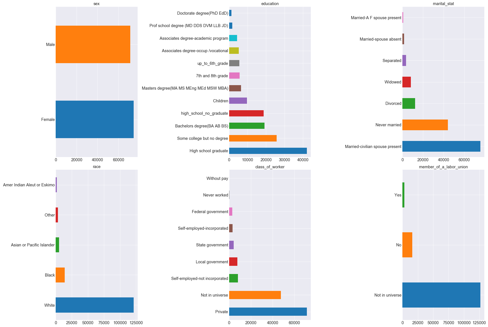

# US Census Income Analysis

## Data Source:
This data was extracted from the census bureau database

**Donor:**
```
Terran Lane and Ronny Kohavi
Data Mining and Visualization
Silicon Graphics.
e-mail: terran@ecn.purdue.edu, ronnyk@sgi.com for questions.
```

The data was split into train/test in approximately 2/3, 1/3 proportions using MineSet's MIndUtil mineset-to-mlc.

Prediction task is to determine the income level for the person represented by the record. Incomes have been binned at the $50K level to present a binary classification problem.

___

## Table of Contents

**[Data Cleaning](#data-cleaning)**<br>
**[EDA](#eda)**<br>
**[Model Results](#model-results)**<br>
**[Model Validation](#model-validation)**<br>
**[Conclusion](#conclusion)**<br>

## Directory Structure
```
.
│   README.md
│   data_cleaning.ipynb    
│   eda.ipynb
|   model.ipynb
|
└───data
│   │   df_merged_learn.pkl
│   │   df_merged_test.pkl
│   │
└───imgs
|
└───src
│   │   eda.py
│   │   model.py
```

## Data Cleaning
(see ```data_cleaning.ipynb```)

I first read in the csv files into pandas DataFrames for both the train and test sets.

- Train set size: 199,523
- Test set size: 99,762

I then followed completed the following:
1. Dropped instance_weight column.
2. Dropped duplicates.
  - There were 46,627 duplicated rows in train and 20,898 duplicated rows in test.
  - **Train set size after dropping duplicates**: 145,776
  - **Test set size after dropping duplicates**: 75,428
  - Dropping duplicates seems to be a critical step in data cleaning. For example, after dropping duplicates, the mean age increased from 34.49 to 40.05. This suggests that leaving duplicates in for analysis would have skewed results toward the younger population.
3. Dropped detailed_industry_recode and detailed_occupation_recode columns since they are duplicates of major_industry_code and major_occupation_code.
4. There were no null values for either train or test.
5. Put education into buckets so that below 1st grade - 6th grade = up_to_6th_grade and 9th grade - 12th grade no diploma = high_school_no_graduate (see bar graph below for distribution).
6. Split income label into binary integer values.

|         | Under $50,000   | Over $50,000  |
| ------- | --------------- | ------------- |
| Train   | 133,424 (91.53%)| 12,352 (8.47%)|
| Test    | 69,242 (91.80%) | 6,186 (8.20%)  |


## EDA
(see ```eda.ipynb```)

### Continuous Variables

**Distribution of continuous variables**


Looking at the distributions of data, only age is somewhat normally distributed.

#### Outlier analysis


wage_per_hour, capital_gains, capital_losses, and dividends_from_stocks have outliers.

For purposes of analysis, I replaced outlier values with means for these columns with the following function:
```
def replace_outliers_with_means(df, column):
    mean = float(df[column].mean())
    df[column] = np.where(df[column] > mean, mean, df[column])
```

**Descriptive Statistics with outliers addressed**

|  | age| wage_per_hour | capital_gains | capital_losses |dividends_from_stocks | num_persons_worked_for_employer |weeks_worked_in_year |
| --- | ---- | --- |------| ------- | ------ | ----- |--------|
|count | 145776 | 145776 | 145776| 145776 |145776 | 145776 |145776 |
|mean| 40.05| 5.88 | 29.99|1.37 | 26.69|2.65 |31.37|
|std|19.05 | 20.28 |130.08 | 8.24 |76.02 |2.40 |23.44|
|min |0.00| 0.00| 0.00|0.00 | 0.00 | 0.00 |0.00|
|25%|26.00 |0.00 |0.00 | 0.00 |0.00| 0.00 |0.00|
|50% | 38.00| 0.00| 0.00|0.00 |0.00 | 2.00 |49.00|
|75%|52.00 |0.00 |0.00 | 0.00 |0.00| 5.00 |52.00|
|max | 90.00|75.85| 594.89| 51.01 |268.79 |6.00 |52.00|

#### Correlations


All continuous variables except wage_per_hour are correlated with income.


### Categorical Variables
Bar graphs for select categorical variables:




There are many "Not in universe" values and potential issues with sparsity when converting these into dummy variables. We'll include all variables for now and see how the model performs.

I dummy coded the categorical variables using pd.get_dummies() and merged the continuous and categorical DataFrames for modeling.


## Model Results

#### Model Considerations:
- High dimensionality
- Large class imbalance with majority with incomes <$50,000

#### Model Approaches:
1. Models chosen:
  - Logistic Regression
  - Ensemble Methods (Random Forest, Boosting)
2. Approaches to address high dimensionality:
  - PCA
  - SMOTE
3. Approaches to address class imbalance:
  - SMOTE

#### Metrics:
I report accuracy, recall, precision, and RMSE. We are interested in accuracy as a metric for classification performance; however, we will also pay particular interest to recall since we may be interested in the model's ability to detect a minority class (>$50,000).

I also conducted **KFolds cross validation** and examined metrics for all models.

### Model Results
(see ```model.ipynb```)
I started with the simplest approach - logistic regression with a train/test split. I compared this model with the ensemble methods.

**Baseline Results**

|| Logistic Regression | Random Forest | Gradient Boosting | AdaBoost|
| --|--|--|--|--|
|Accuracy| 92.99|92.67|93.12|92.90|
|Recall | 67.45|64.81|**69.88**|66.49|
|Precision |35.59|32.33|35.17|35.08|
|RMSE | 0.26|0.27|0.26|0.27|

Performing PCA or using the `class_weight='balanced'` sklearn built-in did not improve performance. KFolds cross validation did not improve performance.

**SMOTE**, however, did improve recall and precision. Thus, I conducted Logistic Regression and Gradient Boosting (as they were the highest performing) with SMOTE.

**SMOTE Results**

|| Logistic Regression | Gradient Boosting |
| --|--|--|
|Accuracy| 85.79| 93.83|
|Recall | 84.25| 93.33|
|Precision | 88.07| 94.44|
|RMSE |0.38| 0.25|

## Model Validation
I evaluated the logistic regression and gradient boosting with SMOTE models on the unseen data (i.e., census_income_test).

**Model Results**

|| Logistic Regression | Gradient Boosting |
| --|--|--|
|Accuracy| 85.51| 94.25|
|Recall | 84.59| 93.97|
|Precision | 86.84| 94.57|
|RMSE |0.38| 0.24|

The models perform very similarly to training and thus seem to generalize to unseen data.

### Feature Importances


These features best predict those who make more than $50,000 a year. Not surprisingly, they relate to occupation, education, age, and activity in stock market.

## Conclusion
These results suggest that a logistic regression model and in particular a gradient boosting model with SMOTE can generalize well to unseen data -- i.e., classify income with accuracy, recall, and precision all around 94% on unseen data -- even with limited feature engineering and high dimensionality. The model should be evaluated on years past 1994 and 1995 to further validate the model.

### Future Steps:
*I didn't do these because the processes would have taken too long with my machine's low memory*

- Remove some extraneous variables using VIF / Feature Importances

**VIF Implementation Example:**
```
from statsmodels.stats.outliers_influence import variance_inflation_factor
vif = pd.DataFrame()
vif["VIF Factor"] = [variance_inflation_factor(df_merged_learn.values, i) for i in range(df_merged_learn.shape[1])]
vif["features"] = df_merged_learn.columns
```

- Grid Search for best parameters

**Grid Search Implementation Example:**
```
from sklearn.model_selection import GridSearchCV
gradient_boost_grid = {'n_estimators': [50, 100, 150, 200],
                      'random_state': [1, None],
                      'learning_rate': [0.1, .5, 1]}
gdr_gridsearch = GridSearchCV(GradientBoostingClassifier(),
                             gradient_boost_grid,
                             n_jobs=-1,
                             verbose=True)
gdr_gridsearch.fit(X_train, y_train)

best_gdr_model = gdr_gridsearch.best_estimator_
best_gdr_model.fit(X_train, y_train)
best_gdr_preds = best_gdr_model.predict(X_test)
```
