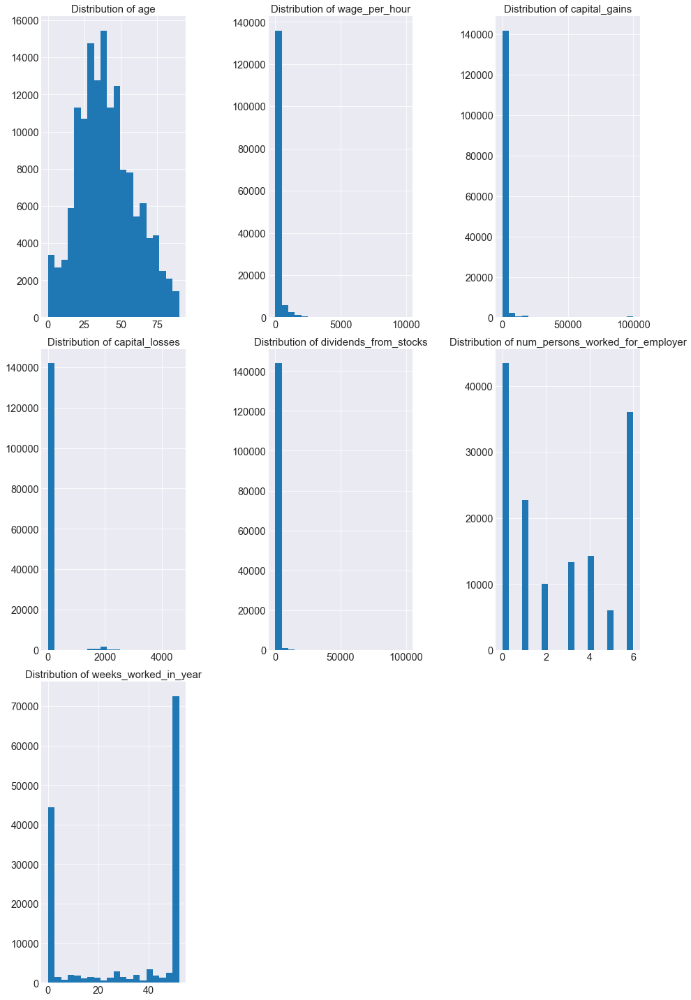
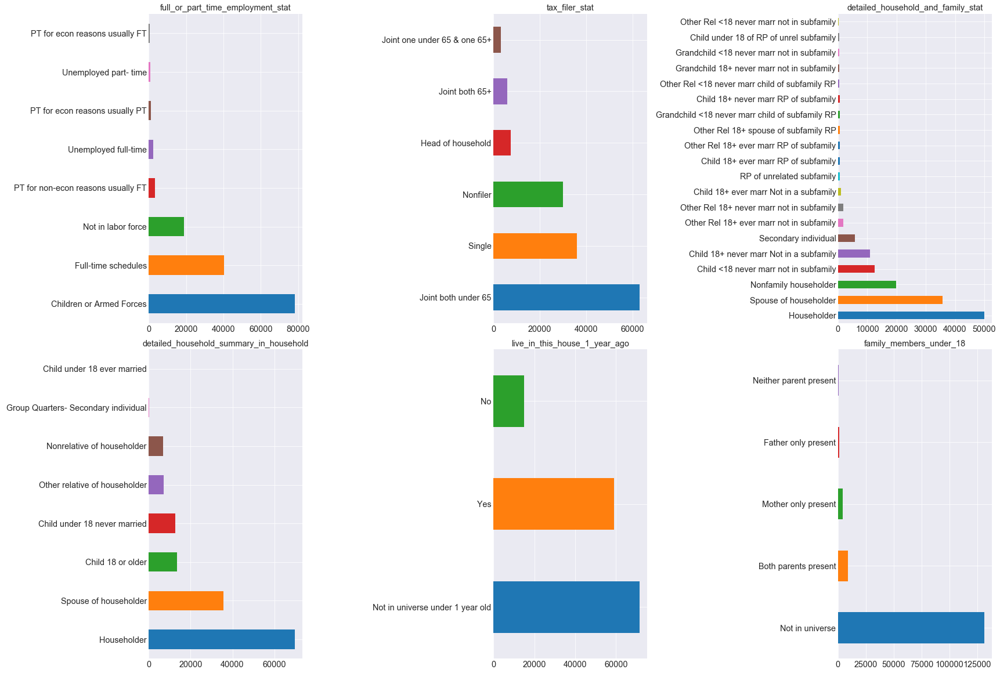

# US Census Income Analysis

## Data Source:
This data was extracted from the census bureau database found at http://www.census.gov/ftp/pub/DES/www/welcome.html

Donor:
```
Terran Lane and Ronny Kohavi
Data Mining and Visualization
Silicon Graphics.
e-mail: terran@ecn.purdue.edu, ronnyk@sgi.com for questions.
```
The data was split into train/test in approximately 2/3, 1/3 proportions using MineSet's MIndUtil mineset-to-mlc.

Prediction task is to determine the income level for the person represented by the record. Incomes have been binned at the $50K level to present a binary classification problem.


### Data cleaning steps:
I first read in the csv files into pandas DataFrames for both the train and test sets.

- Train set size: 199,523
- Test set size: 99,762

I then followed completed the following:
1. Dropped instance_weight column.
2. Dropped duplicates.
  - There were 46,627 duplicated rows in train and 20,898 duplicated rows in test.
  - **Train set size after dropping duplicates**: 145,776
  - **Test set size after dropping duplicates**: 75,428
  - Dropping duplicates seems to be a critical step in data cleaning. For example, after dropping duplicates, the mean age increased from 34.49 to 40.05. This suggests that leaving duplicates in for analysis would have skewed results toward the younger population.
3. Dropped detailed_industry_recode and detailed_occupation_recode columns since they are duplicates of major_industry_code and major_occupation_code.
4. There were no null values for either train or test.
5. Put education into buckets so that below 1st grade - 6th grade = up_to_6th_grade and 9th grade - 12th grade no diploma = high_school_no_graduate

| Education level  | Number (train set)  |
| --------------- | ------------- |
|High school graduate                 |     42,206|
| Some college but no degree           |     25,740|
| Bachelors degree(BA AB BS)            |    19,137|
| High school no graduate                 |   18,729|
|Children                                 |  9,742|
| Masters degree(MA MS MEng MEd MSW MBA)   |  6,396|
| 7th and 8th grade                         | 5,766|
| Up to 6th grade                      |       5,542|
| Associates degree-occup /vocational  |      5,173|
| Associates degree-academic program    |     4,295|
| Prof school degree (MD DDS DVM LLB JD) |    1,789|
| Doctorate degree(PhD EdD)               |   1,261|

6. Split income label into binary integer values.

|         | Under $50,000   | Over $50,000  |
| ------- | --------------- | ------------- |
| Train   | 133,424 (91.53%)| 12,352 (8.47%)|
| Test    | 69,242 (91.80%) | 6186 (8.20%)  |


## EDA

### Continuous Variables

**Distribution of continuous variables**


Looking at the distributions of data, only age is somewhat normally distributed.

**Outlier analysis**


wage_per_hour, capital_gains, capital_losses, and dividends_from_stocks have outliers.

For purposes of analysis, I replaced outlier values with means for these columns with the following function:
```
def replace_outliers_with_means(df, column):
    mean = float(df[column].mean())
    df[column] = np.where(df[column] > mean, mean, df[column])
```

**Correlations**

All continuous variables except wage_per_hour are highly correlated with income


#### Categorical Variables




It looks like there are a lot of "Not in universe" and potential issues with sparsity when converting these into dummy variables. We'll include all variables for now and see how the model performs.

*Initial results*
accuracy: 0.9278436461738911
precision: 0.6554216793596649
recall: 0.30543324071438405
rmse: 0.26861196824997646
